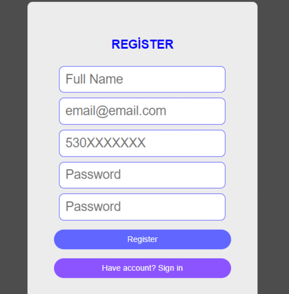

Login ve register giriş sayfası projesi.

Register olan kullanıcının verileri local storage'da tutularak giriş yap sayfasında local storage'dan veriler alınarak giriş yapması sağlanıyor.
Input alanlarında regex validationlar kullanındı ayrıca şifre ve şifre tekrarı kontrolu yapıldı.
Change Theme butonu ile tema değiştirme işlemi yapıldı. Siyah beyaz olarak tıklandığında değişiyor.

# Vue 3 + Vite

This template should help get you started developing with Vue 3 in Vite. The template uses Vue 3 `<script setup>` SFCs, check out the [script setup docs](https://v3.vuejs.org/api/sfc-script-setup.html#sfc-script-setup) to learn more.

## Recommended IDE Setup

- [VS Code](https://code.visualstudio.com/) + [Volar](https://marketplace.visualstudio.com/items?itemName=Vue.volar)
